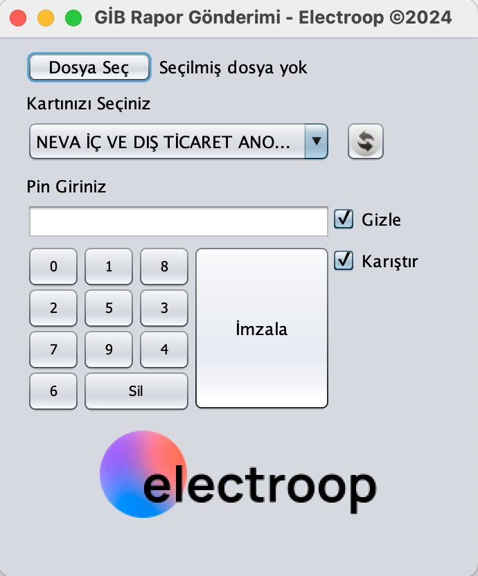

# gib-ökc-rapor

## Amaç ve Kapsam

[Electroop](https://electroop.io) tarafından sağlanan bu masaüstü Java uygulaması sayesinde, AKİS uyumlu USB akıllı kart tipindeki mali mührünüzü kullanarak, elektrikli araçların şarj hizmetlerine ilişkin, ŞARJANLIK türünde düzenlediğiniz faturalara karşılık gelen aylık raporlarınızı Gelir İdaresi Başkanlığı'nın ÖKC (Ödeme Kaydedici Cihaz) web servisine imzalı ve toplu olarak, tek dosya halinde gönderebilirsiniz.  



## Gerekli Java Sürümü

Java = 1.8.0_xxx (AKİS Kart İzleme Aracı - *AKİA*'nın makinede çalışır durumda olması gerekli koşulu sağlar)  

Makinede aktif olan Java sürümü aşağıdaki komut ile terminal ya da komut istemi ekranında teyit edilebilir:  
```bash
java -version
```

## Kurulum

Programı Windows ya da MacOS işletim sistemine sahip masaüstü bilgisayarınıza kurmak için aşağıdaki adımları izleyiniz:  

1. Bu kod deposundaki dosyaları Code > Download ZIP seçimiyle topluca ve sıkıştırılmış olarak bilgisayarınıza indirin.  

2. Sıkıştırılmış arşiv dosyasını (.zip), Mac'te /Users, Windows'ta C:\Users altında bulunan kendi kullanıcı dizininizin hemen altında, ayrı bir klasör halinde açın.
3. Kullanıcı dizininizin hemen altında **.sertifikadeposu** (tümü küçük harf - ÖNEMLİ!) olarak adlandırılmış bir dizin mevcut değilse oluşturun. 
4. Bu kod deposu ile birlikte gelen, **sertifikadeposu** dizini altındaki **SertifikaDeposu.svt** dosyasını, kullanıcı dizininizin altındaki **.sertifikadeposu** dizinine kopyalayın. Aynı isimli bir dosya söz konusu dizinde mevcut ise (ki bilgisayarınızda AKİA programı kurulu ise bu dosya muhtemelen mevcut olacaktır) **SertifikaDeposu.svt** dosyasını kopyalamadan önce mevcut dosyanın adını değiştirin.  
5. Program, MacOS için sonu .sh ile biten, Windows içinse sonu .bat ile biten üçer adet çalıştırma dosyası ile birlikte gelmektedir. Bilgisayarınızın işletim sistemine göre, bu .sh veya .bat dosyalarının her birindeki vergi kimlik numarasını (--vkn parametresinin sağına 1234567890 olarak girilmiş olan değeri), mali mührünüze bağlanmış olan, kendi gerçek vergi kimlik numaranız ile değiştirerek kaydedin.  
6. Çalışma dosyalarının, adı **test** ile biteni GİB ÖKC servisinin **TEST** ortamına, adı **prod** ile biteni ise GİB ÖKC servisinin **CANLI** yani **GERÇEK** ortamına rapor gönderimi için kullanılır. Her iki çalışma dosyası da rapor dönemi olarak _içinde bulunulan aydan bir önceki ayı baz alarak_ rapor hazırlar. Örneğin 2025 Ocak ayı içinde bulunuyorsak, rapor 2024 Aralık ayı için hazırlanacak demektir. Bir önceki aydan daha önceki aylar için rapor hazırlamak gerekirse üçüncü çalışma dosyasını kullanabilir ve programı çalıştırmadan önce --months parametresinin hemen yanında yer alan 2 değerini gerektiği gibi 3, 4, 5 vb. değiştirebilirsiniz. Değiştirilmemiş haliyle çalıştırma dosyası 2 ay önceki dönem için rapor hazırlayacak şekilde ayarlanmıştır. Örneğin 2025 Ocak ayı içinde bulunuyorsak, program bu çalıştırma dosyası ile çalıştırılacak olursa, rapor 2024 Kasım ayı için hazırlanacak demektir.  
7. Kullanacağınız çalıştırma dosyaları için masaüstüne veya kullanım kolaylığı açısından uygun bulduğunuz başka bir yere kısa yollar (shortcut) oluşturabilirsiniz.  
8. AKİS Kart İzleme Aracı (AKİA) bilgisayarda kurulu ve çalışır durumda değil ise BİLGEM Kamu Sertifikasyon Merkezi'nin sürücü yükleme sayfasından akıllı kart tipindeki AKİS uyumlu mali mührünüz için işletim sisteminize uygun olan sürücü yazılımını indirerek makinenize kurmanız gereklidir. 

## Kullanım

1. İlgili döneme ilişkin raporlayacağınız şarjlanma verisini **sample-excel.xlsx** dosyasında verilen formatta bir Excel dosyası halinde hazırlayınız. Programın çalışması için, başka kolonların yanı sıra, içinde "plaka", "kwh" ve "tl" başlığı ile adlandırılmış 3 adet kolonu olan herhangi bir Excel dosyası iş görecektir. Program, çalışmaya başladığında ilk olarak verilen Excel dosyasında bu şekilde adlandırılmış üç adet kolonun bulunup bulunmadığını denetler. Kolonların sırası önemli olmadığı gibi, kolon isimlerinin adlandırılmasında büyük veya küçük harf kullanılmış olması da program tarafından göz ardı edilir.  

2. Plaka değerlerinin hiçbiri boş olmamalıdır. Plaka değerleri 2 ila 12 karakter arası bir uzunluğa sahip olmalıdır.
3. Kwh ve TL değerlerinin hiçbiri boş olmamalı, bu alanlarda rakamlardan başkaca "TL" vb. para birimi ibareleri ya da "sıfır" anlamında tire vb. işaretler bulunmamalıdır. Kwh ve TL değerlerinde ondalık noktasından sonra en fazla 2 hane kullanılmış olmalıdır.  
4. Girdi olarak verilen Excel dosyasında plaka numaraları tekrar edebilir. Program, tüm plaka numaralarını boşluklardan arındırıp büyük harfe çevirerek normalize ettikten sonra, bu normalize plaka numaraları bazında Kwh ve tutar toplamlarını hesaplayıp her bir plaka için tek satırlık veri oluşturur. Bu verilerin tümü tek bir dosya halinde, aynı rapor içinde GİB'e gönderilir.    
5. Rapor verisinin doğru hazırlanması en önemli konudur. Rapor verisini doğru olarak hazırladığınızdan emin olunca PIN değerini bildiğiniz, AKİS uyumlu, akıllı kart tipindeki mali mührünüzü bilgisayarın USB portuna takınız.
6. Gönderim yapacağınız ortama (TEST veya CANLI) ve istediğiniz rapor dönemine uygun olan çalıştırma dosyasının kısayoluna tıklayarak programı çalıştırınız. Not1: Canlı ortama gönderimden önce MUTLAK TEST ortamına gönderimi deneyerek rapor verisini doğrulayıp gönderimin başarıyla gerçekleştiğinden emin olunuz. Not2: TEST ortamına gönderimde nadiren de olsa GİB tarafından "Paket Bulunamadı" hatası dönebilir. Bu durum her ayın 15'i olan son gönderim tarihine dek değişmediği takdirde doğrudan CANLI ortama gönderim yapabilirsiniz.
7. Program çalışınca açılan pencerede "Dosya Seç" butonu aracılığıyla rapor verisinin yer aldığı Excel dosyasını seçip mali mührünüzün PIN'ini girdikten sonra "İmzala" butonuna basınız.
8. Gönderim sonucu ayrı bir pencerede görüntülenene dek bekleyiniz ve başkaca bir şey yapmayınız.
9. Gönderim sonucu pencerede raporlandıktan sonra ana pencereyi kapatarak programdan çıkabilirsiniz.
10. Program, GİB'e gönderilen raporun ham ve imzalı halini, GİB servislerinden dönen mesajlarla ve hata ayıklama amacıyla yazdırılan başka mesajlarla birlikte bir log dosyasına yazmış olmalıdır. Log dosyasını, rapor dönemine ve gönderimin yapıldığı ortama göre **GİB-Rapor-Ocak2025.log** şeklinde adlandırılmış olarak kullanıcı dizininizin altında bulabilirsiniz. Test ortamına gönderimlerde log dosyasının sonuna **-Test** eklenecektir.
11. Gönderimin başarıyla sonuçlanmış olması durumunda gönderime ait log dosyasının son satırında 30 ile vergi kimlik numaranız arasında, önünde ve sonunda yıldız karakterleri bulunan UUID değeri, rapor gönderimine ilişkin **Paket ID**si olup bu paket id'yi muhtemel sorunlarda GİB ile iletişime geçmeniz gerektiği durumlarda referans olması bakımından ayrı bir yere yazmanız ve programın oluşturduğu tüm log dosyalarını saklamanız önerilir.     

### Teknik ve Yasal Bilgilendirme

Yazılımın geliştirilmesinde [TÜBİTAK MA3 e-İmza kütüphanelerinden](https://yazilim.kamusm.gov.tr/?q=tr/ma3-e-imza-k%C3%BCt%C3%BCphaneleri), ekran tasarımında ise [mza](https://github.com/dsinan/mza) GitHub kod deposundan yararlanılmıştır. Uygulama, Windows 10, Windows 11, MacOS 15.1.1 işletim sistemine sahip masaüstü bilgisayarlarda, ATR19 ve ACS ACR39U ICC Mini Akıllı Kart Okuyucuları ile test edilmiştir.    

[Electroop](https://electroop.io), hizmet verdiği müşterileri haricinde, yazılımla ilgili destek verme, güncelleme, doğru ve zamanında çalışmayı temin etme taahhüdünde bulunmadığı gibi, bu yazılımın kullanılmasından, değiştirilmesinden doğabilecek sonuçlardan da sorumlu tutulamaz. Yazılımın yukarıda belirtilen hususlara dikkat edilerek, amaca uygun olarak, doğru verilerle, doğru bir biçimde kullanılıp kullanılmadığı, programı indirerek kullanan kişi ve kuruluşların sorumluluğundadır. Electroop, yazılımın kimler tarafından hangi amaçla kullanıldığı bilgisini haiz değildir; ancak bu yazılım yoluyla programı kullanan kişilerin makinelerinden rapor verisi, kişisel bilgiler, rapor gönderim logları dahil olmak üzere, hiçbir dosyayı ve veriyi hiçbir şekilde edinmediğini, gerektiği takdirde kodla da kendiliğinden belgelenebileceği üzere, ilgililere bildirir ve açıkça beyan eder.   

&copy;Electroop, 2024
